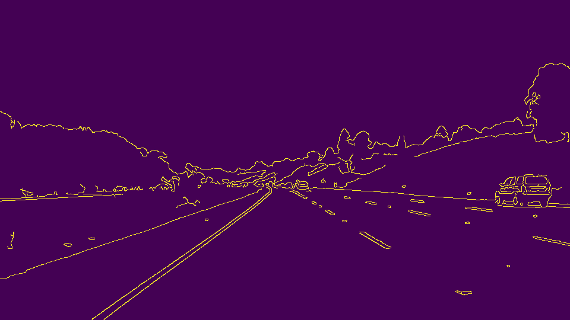
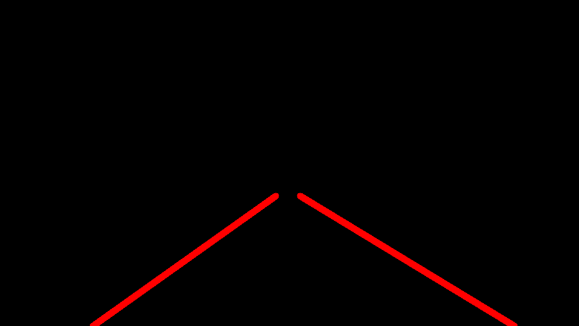
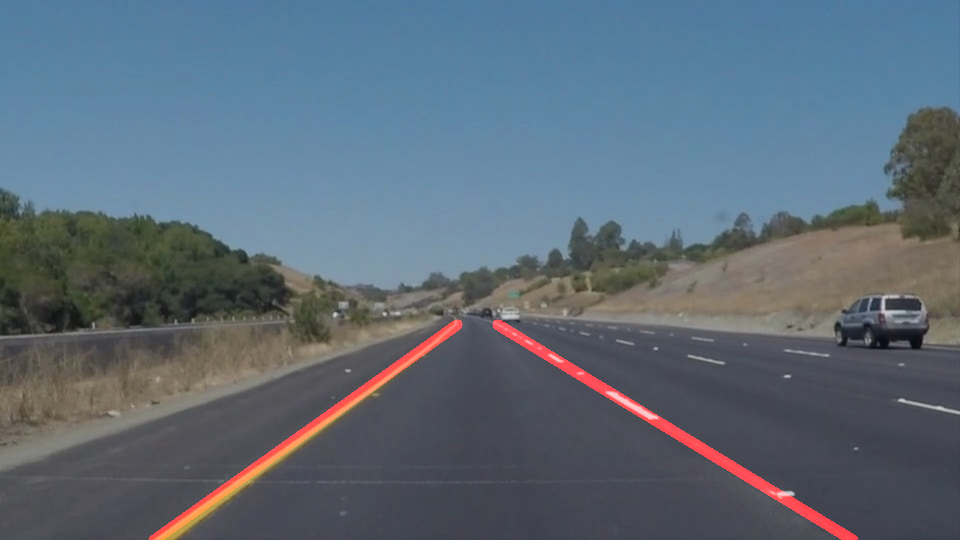

# **Finding Lane Lines on the Road** 

**Finding Lane Lines on the Road**

The goals / steps of this project are the following:
* Make a pipeline that finds lane lines on the road
* Reflect on your work in a written report

### Reflection

### 1. Describe your pipeline.

My pipeline consisted of 5 steps. 

- First, I converted the images to grayscale using the function `grayscale`, as shown below:

- Second, I applied a Gaussian filter using the function `gaussian_blur` to the gray scale image

- Third, I detect the edges on the image, using the `canny` function. The result is similar to the image below:

- Fourth, I get the edges only for the region of interest using the function `region_of_interest`, as shown below:

- Fifth, the lines of the region of interest are extracted and drawn using the function `hough_lines` on the image that contains the edges in the region of interest:

- Sixth, the original image and the image from the last step are averaged using the function `weighted_img` in order to draw the lane lines in the  original image:

---

In order to draw a single line on the left and right lanes, I modified the draw_lines() function by:

- After getting the hough lines, what I need is to separate the lines in two groups, one having the lines for the left lane, and the other having the lines for the right lane. To do that, for each point in the lines list, I compute the slope and the intercept. A postive slope indicates that the line correspond to the left lane and a negative slope indicates that the line correponds to the right lane. Then, in order to get one line for each lane, I compute the average of the slope and intercept for each one of the two lists of slopes/intercepts. I defined a function `lanes_average` that makes this process

- Then with the average estimates of the intercept and slope for the two lanes, I compute the points to draw the lines. This is donde in functions `line_points` and `lane_points`

- The last step is to draw the extrapolated lines in the image using the function `draw_lane_lines`

### 2. Identify potential shortcomings with your current pipeline

- One potential shortcoming would be what would happen when there is a curve, in that case is difficult to compute a straight line that defines the whole lane. There is also a shortcoming here related with area of interest, in that it could not be as accurate as you want

- Another shortcoming could be the light conditions, for example if it is a sunny day and there is a shadow that could be considered as a line

- The road also influence the performance, for example if the line is dashed and in many parts it seems more like a point than a line, or if the color of the line is vanishing

- The maximum line lenght is also a thing to have into account because depends on the road conditions

- Also, could be other lines on the lane that not delimite a lane, for example barriers or objects in the edge of the road

### 3. Suggest possible improvements to your pipeline

A possible improvement would be to improve the scenario when it is a curve

Another potential improvement could be to set weights to lines that are more likely to form a lane line, because sometimes the average of the lines is not as accurate as I want

